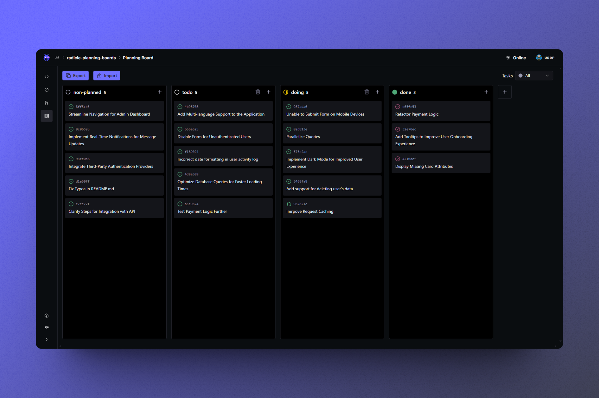

[](https://app.netlify.com/sites/chipper-wisp-c7553e/deploys)

# Radicle Planning Boards

A project management web app leveraging [Radicle](https://radicle.xyz/) Issues and Patches.

[Radicle](https://radicle.xyz/) is a GitHub alternative bringing familiar features like Pull
Requests, Issues, etc, via a peer-to-peer, free and open-source network built on top of Git.

> DISCLAIMER: Radicle Planning Boards is currently in the early stages of development (alpha). As
> such, features found in similar tools may not be available.

## Features

- Kanban Board View
- Create and Arrange Columns
- Import/Export Columns
- Move Cards between Columns
- Create New Issues
- Filter by Issues or Patches
- [Radicle Interface Integration](#radicle-interface-integration)

### Radicle Interface Integration

Radicle Planning Boards is built with [Radicle Interface](https://app.radicle.xyz/nodes/seed.radicle.garden/rad:z4V1sjrXqjvFdnCUbxPFqd5p4DtH5)
integration in mind, a web-based client for the [Radicle](https://radicle.xyz/) peer-to-peer
network. This allows it to leverage features like authentication, themes, and more to provide a
seamless experience for users.

## Under the hood

To persist the column and position of the cards, Radicle Planning Boards leverages the
issue's/patch's labels. The labels are used to store the column (`RPB:column:{columnName}`) and
position (`RPB:priority:{priority}`) of the card. This allows the app to work within Radicle's
feature set and not require its own database.

## Self hosting

You will need two domains, one for the Radicle Planning Boards and another for the Radicle Interface.

1. Deploy the `radicle-planning-boards` repository
    - Set the `NUXT_PUBLIC_PARENT_ORIGIN` environment variable to your Radicle Interface domain
2. Deploy the [radicle-interface-with-planning-boards](https://github.com/maninak/radicle-interface-with-planning-boards)
repository
    - Update `src/config.json` with your Radicle Planning Boards domain e.g.

    ```json5
    // src/config.json
    {
      // ...
      "plugins": {
        "radiclePlanningBoards": {
          "enabled": true,
          "origin": "https://radicle-planning-boards.example.com"
        }
      }
      // ...
    }
    ```

## Contributing

Please refer to the [Contribution Guide](CONTRIBUTING.md).
